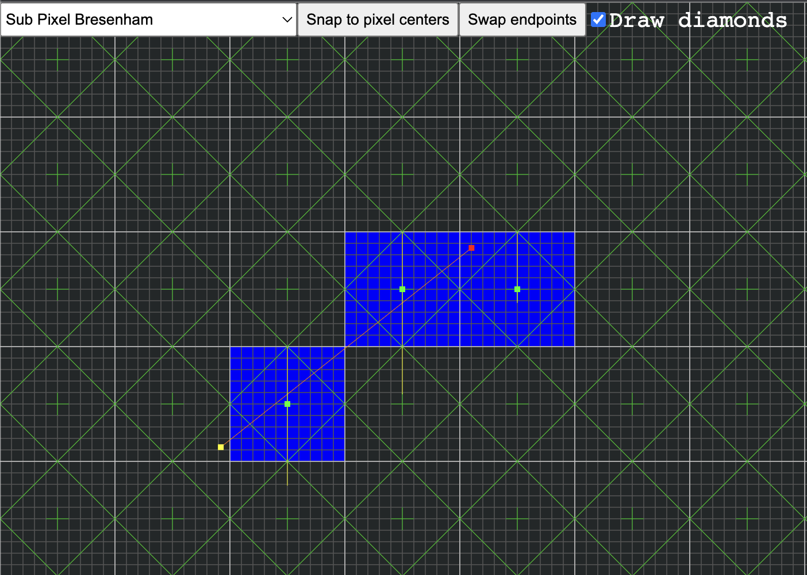
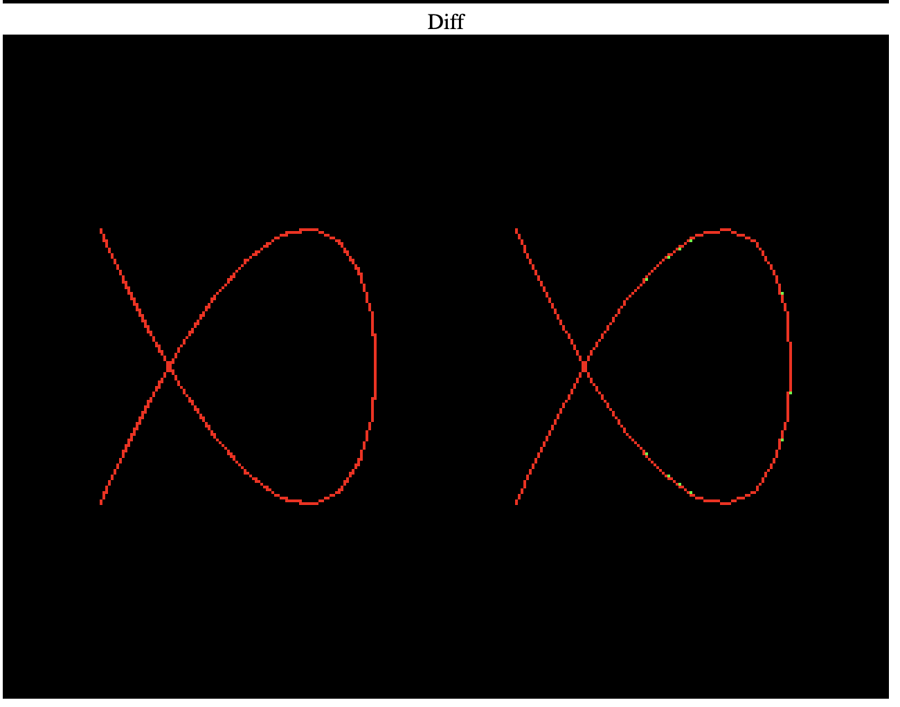

# Line rasterization playground

A little JS/HTML playground for testing various line rasterization algorithms, including DDA, Bresenham, as well as sub-pixel precision versions of these algorithms.

The playground shows:
* A zoomed pixel grid, with pixel centers at `(0.5, 0.5)` high-lighted as a little cross, as well as sub-pixel subdivisions.
* Optionally, inscribed diamonds in each pixel for visually checking behaviour with respect to the [diamond exit rule](https://learn.microsoft.com/en-us/windows/win32/direct3d11/d3d10-graphics-programming-guide-rasterizer-stage-rules#line-rasterization-rules-aliased-without-multisampling)
* A line segment in orange that represents the continuous version of the line to be rasterized.
    * The red dot is the start point
    * The yellow dot is the end point
    * You can drag the end points
* Simple UI to select the algorithm, snap end points to pixel centers, reset the line, and swap endpoints

To run the playground, simply open the `index.html` in a browser of choice. 

For development, I recommend installing [Node.js](https://nodejs.org/en/), then running the `dev.sh` script. It will spin up [live-server](https://www.npmjs.com/package/live-server) on [http://localhost:3000](http://localhost:3000) and open a browser tab. If you make and save changes to the code in `index.js` or `index.html`, the browser tab will auto-reload.

## (Sub-pixel) line rasterization algorithms
You can find the implementations of various (sub-pixel) line rasterization algorithms in the [`algorithms.js`](algorithms.js) file.

Each algorithm takes a start (`x1, y1`) and end point (`x2, y2`), then determines which pixels in between those points to "light" up via `drawPixel()`. If you copy the algorithm, replace `drawPixel()` with whatever your framework of choice offers to set a pixel. You may also want to pass a color to the function to be used with your pixel drawing function.

Some algorithms will also push debugging information, like error term values, or sampled point locations, to the global lists `steppedPoints` and `helperLines`. If you copy the algorithms, just remove lines that access those globals.

The following algorithms have been implemented.

* `lineDDA`: DDA, calculates the number of pixels on the major axis, then samples at a (`deltaX / numPixels`, `deltaY / numPixels`) interval along the line. Gives the same result as Bresenham, but uses floating point math.
* `lineSubpixelDDA`: Sub-pixel DDA. Almost the same as the integer DDA, but works straight off of the sub-pixel start and end point. This basically lerps between the start and end point for `numPixel - 1` steps.
* `lineSubpixelDDACenterSampling`: Sub-pixel DDA, but instead of sampling the line at `numPixel - 1` steps, it sample's the pixels between the start and end point at the pixel-center on the major axis. This makes it more similar to sub-pixel Bresenham. Omits the end point pixel to simulate that property of the diamond exit rule. This end point rule is currently a bit broken for 2 edge cases.
* `lineSubpixelDDACenterSamplingIncludeEndpoint`: Same as above, but doesn't omit the end point. This end point rule is currently a bit broken for 2 edge cases.
* `lineBresenham1`: Basic floating point Bresenham without any optimizations. Easier to understand the basic idea behind Bresenham (only increase minor axis if the accumulated slope is > 1 pixel).
* `lineBresenham1`: Floating point Bresenham that rewrites the error term check from `error > 0.5` to `error > 0`.
* `lineBresenham2`: Floating point Bresenham that pre-calculates the slope with which the error term gets updated, removing the division from the inner loop,
* `lineBresenham3`: Floating point Bresenham that eliminates the division in the slope calculation by scaling the error term and all operations on it by `deltaX` or `deltaY` depending on the major axis.
* `lineBresenham`: The "final" integer only version of Bresenham's algorithm. Gets rid of the `0.5` factor in the initial error term calculation by scaling the error term and all operations on it by `2`. This could be further optimized by precalculating `deltaX * 2` and `deltaY * 2` and using left-shifts instead of multiplication. Left as an exercise to the reader.
* `lineSubPixelBresenham`: a sub-pixel implementation of Bresenham's algorithm. For x-major lines, the error term is initialized as the distance from the start pixel's bottom edge (or top edge if y is decremented) to the next pixel's y-coordinate. For y-major lines, the error term is initialized as the distance from the start pixel's left edge (or right edge if x is decremented) to the next pixel's x-coordinate. The remainder of the algorithm is the same as "standard" pixel-center Bresenham. Note that while this algorithm does not include floating point division, it still requires floating point or fixed point precision, since the start and end point as well as the initial error term being rational numbers. Omits the end point to simulate that property of the diamond exit rule.

## Bonus: Lissajous

While the playground is nice to create and debug line rasterization algorithms, it's not great to appreciate the finer details of sub-pixel line rasterization. That's best observed in motion.

The [`lissajous.html`](lissajous.html) file is a small demo app, that draws [`Lissajous curves`](https://en.wikipedia.org/wiki/Lissajous_curve) with WebGL, as well as the CPU rasterizers implemented in [`algorithms.js`](algorithms.js). The WebGL implementation serves as a reference implementation, as it implements sub-pixel line rasterization with diamond exit rule support.

The demo displays the WebGL version, followed by the CPU rasterizer version, followed by a diff of the output of the two versions.
 
To run and debug the demo, open [`lissajous.html`](lissajous.html) in a browser of your choice, or use the `dev.sh` script as described above, then navigate to `http://localhost:3000/lissajous.html`.